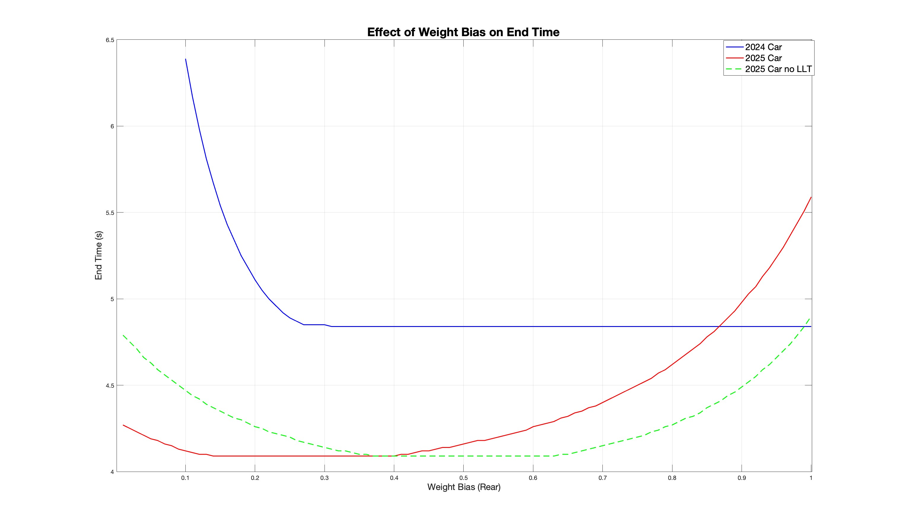

# UQ Racing Straight Line Acceleration Simulation
This project presents a model and analysis in MATLAB for the Formula SAE 75m straight-line acceleration event, based on UQ Racing's 2024 and proposed 2025 cars. 

# Purpose
To produce an accurate model of sensitive vehicle parameters to determine optimisations for this event and benchmark performance of 2025 AWD vehicle with 2024 RWD design.
Specifically, the effect of weight bias on finishing time for both year's cars was analysed, revealing key areas of improvement.

# Findings
As seen in the plots within the folder visuals, the 2025 car's FWD power is limited by static friction limits on the front tyres at its current weight bias (0.53 from the front axle) meaning the maximum available power cannot be applied at first without slipping - see Figure 1.
It can be seen that reducing the weight bias to put more weight over the front wheels allows for better power transfer. This doesn't sacrifice grip on the rear tyres as the effect of longitudinal load transfer (LLT) shifts more weight onto the rear tyres, providing additional traction. The plot shows that when the effect of LLT is ignored, the optimal weight bias is at the centre of the car, around 0.4 - 0.6 however with the effect of LLT, the optimal bias is in the range of 0.15-0.35 (Figure 2). 
With these improvements, the 2025 car sees ~0.8 seconds reduction in time compared to the 2024 car, a significant improvement due to the additional power available through the AWD system.

Figure 1: Forces acting at contact patch

Figure 2: Weight bias vs end time
